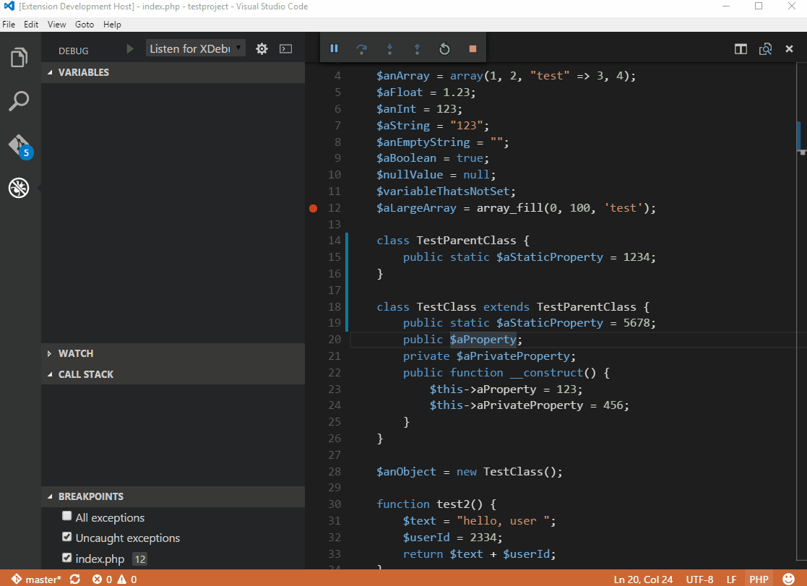

# PHP Debug Adapter for Visual Studio Code

[](https://marketplace.visualstudio.com/items?itemName=xdebug.php-debug) [](https://marketplace.visualstudio.com/items?itemName=xdebug.php-debug) [](https://marketplace.visualstudio.com/items?itemName=xdebug.php-debug) [](https://github.com/xdebug/vscode-php-debug/actions?query=branch%3Amain) [](https://codecov.io/gh/xdebug/vscode-php-debug) [](https://github.com/prettier/prettier) [](https://github.com/semantic-release/semantic-release)



### Sponsor PHP Debug Adapter for Visual Studio Code

If you find this extension useful, if it helps you solve your problems and if you appreciate the support given here, consider sponsoring our work.

## Installation

Install the extension: Press `F1`, type `ext install php-debug`.

This extension is a debug adapter between VS Code and [Xdebug](https://xdebug.org/) by Derick Rethans. Xdebug is a PHP extension (a `.so` file on Linux and a `.dll` on Windows) that needs to be installed on your server.

1. [Install Xdebug](https://xdebug.org/docs/install)
   **_I highly recommend you make a simple `test.php` file, put a `phpinfo();` statement in there, then copy the output and paste it into the [Xdebug installation wizard](https://xdebug.org/wizard.php). It will analyze it and give you tailored installation instructions for your environment._** In short:

   - On Windows: [Download](https://xdebug.org/download.php) the appropriate precompiled DLL for your PHP version, architecture (64/32 Bit), thread safety (TS/NTS) and Visual Studio compiler version and place it in your PHP extension folder.
   - On Linux: Either download the source code as a tarball or [clone it with git](https://xdebug.org/docs/install#source), then [compile it](https://xdebug.org/docs/install#compile). Or see if your distribution already offers prebuilt packages.

2. [Configure PHP to use Xdebug](https://xdebug.org/docs/install#configure-php) by adding `zend_extension=path/to/xdebug` to your php.ini. The path of your php.ini is shown in your `phpinfo()` output under "Loaded Configuration File".

3. Enable remote debugging in your `php.ini`:

   For Xdebug v3.x.x:

   ```ini
   xdebug.mode = debug
   xdebug.start_with_request = yes
   ```

   For Xdebug v2.x.x:

   ```ini
   xdebug.remote_enable = 1
   xdebug.remote_autostart = 1
   xdebug.remote_port = 9000
   ```

   There are other ways to tell Xdebug to connect to a remote debugger, like cookies, query parameters or browser extensions. I recommend `remote_autostart` (Xdebug v2)/`start_with_request` (Xdebug v3) because it "just works". There are also a variety of other options, like the port, please see the [Xdebug documentation on remote debugging](https://xdebug.org/docs/remote#starting) for more information. Please note that the default Xdebug port changed between Xdebug v2 to v3 from 9000 to 9003.

4. If you are doing web development, don't forget to restart your webserver to reload the settings.

5. Verify your installation by checking your `phpinfo()` output for an Xdebug section.

### VS Code Configuration

In your project, go to the debugger and hit the little gear icon and choose _PHP_. A new launch configuration will be created for you with three configurations:

- **Listen for Xdebug**
  This setting will simply start listening on the specified port (by default 9003) for Xdebug. If you configured Xdebug like recommended above, every time you make a request with a browser to your webserver or launch a CLI script Xdebug will connect and you can stop on breakpoints, exceptions etc.
- **Launch currently open script**
  This setting is an example of CLI debugging. It will launch the currently opened script as a CLI, show all stdout/stderr output in the debug console and end the debug session once the script exits.
- **Launch Built-in web server**
  This configuration starts the PHP built-in web server on a random port and opens the browser with the `serverReadyAction` directive. The port is random (localhost:0) but can be changed to a desired fixed port (ex: localhost:8080). If a router script is needed, add it with `program` directive. Additional PHP/Xdebug directives trigger debugging on every page load.

There are also configurations for Xdebug v2 (Legacy) installations.

More general information on debugging with VS Code can be found on https://code.visualstudio.com/docs/editor/debugging.

> _Note:_ You can even debug a script without `launch.json`. If no folder is open, and the VS Code status bar is purple, pressing `F5` will start the open script with Xdebug3 specific parameters. If the php executable is not in path, you can provide it with the setting `php.debug.executablePath`. For debugging to work, Xdebug must still be correctly installed.

#### Supported launch.json settings:

- `request`: Always `"launch"`
- `hostname`: The address to bind to when listening for Xdebug (default: all IPv6 connections if available, else all IPv4 connections) or Unix Domain socket (prefix with `unix://`) or Windows Pipe (`\\?\pipe\name`) - cannot be combined with port
- `port`: The port on which to listen for Xdebug (default: `9003`). If port is set to `0` a random port is chosen by the system and a placeholder `${port}` is replaced with the chosen port in `env` and `runtimeArgs`.
- `stopOnEntry`: Whether to break at the beginning of the script (default: `false`)
- `pathMappings`: A list of server paths mapping to the local source paths on your machine, see "Remote Host Debugging" below
- `log`: Whether to log all communication between VS Code and the adapter to the debug console. See _Troubleshooting_ further down.
- `ignore`: An optional array of glob patterns that errors should be ignored from (for example `**/vendor/**/*.php`)
- `ignoreExceptions`: An optional array of exception class names that should be ignored (for example `BaseException`, `\NS1\Exception`, `\*\Exception` or `\**\Exception*`)
- `skipFiles`: An array of glob patterns, to skip when debugging. Star patterns and negations are allowed, for example, `**/vendor/**` or `!**/vendor/my-module/**`.
- `skipEntryPaths`: An array of glob patterns, to immediately detach from and ignore for debugging if the entry script matches (example `**/ajax.php`).
- `maxConnections`: Accept only this number of parallel debugging sessions. Additional connections will be dropped and their execution will continue without debugging.
- `proxy`: DBGp Proxy settings
  - `enable`: To enable proxy registration set to `true` (default is `false).
  - `host`: The address of the proxy. Supports host name, IP address, or Unix domain socket (default: 127.0.0.1).
  - `port`: The port where the adapter will register with the the proxy (default: `9001`).
  - `key`: A unique key that allows the proxy to match requests to your editor (default: `vsc`). The default is taken from VSCode settings `php.debug.idekey`.
  - `timeout`: The number of milliseconds to wait before giving up on the connection to proxy (default: `3000`).
  - `allowMultipleSessions`: If the proxy should forward multiple sessions/connections at the same time or not (default: `true`).
- `xdebugSettings`: Allows you to override Xdebug's remote debugging settings to fine tuning Xdebug to your needs. For example, you can play with `max_children` and `max_depth` to change the max number of array and object children that are retrieved and the max depth in structures like arrays and objects. This can speed up the debugger on slow machines.
  For a full list of feature names that can be set please refer to the [Xdebug documentation](https://xdebug.org/docs-dbgp.php#feature-names).
  - `max_children`: max number of array or object children to initially retrieve
  - `max_data`: max amount of variable data to initially retrieve.
  - `max_depth`: maximum depth that the debugger engine may return when sending arrays, hashes or object structures to the IDE (there should be no need to change this as depth is retrieved incrementally, large value can cause IDE to hang).
  - `show_hidden`: This feature can get set by the IDE if it wants to have more detailed internal information on properties (eg. private members of classes, etc.) Zero means that hidden members are not shown to the IDE.
- `xdebugCloudToken`: Instead of listening locally, open a connection and register with Xdebug Cloud and accept debugging sessions on that connection.
- `stream`: Allows to influence DBGp streams. Xdebug only supports `stdout` see [DBGp stdout](https://xdebug.org/docs/dbgp#stdout-stderr)
  - `stdout`: Redirect stdout stream: 0 (disable), 1 (copy), 2 (redirect)

Options specific to CLI debugging:

- `program`: Path to the script that should be launched
- `args`: Arguments passed to the script
- `cwd`: The current working directory to use when launching the script
- `runtimeExecutable`: Path to the PHP binary used for launching the script. By default the one on the PATH.
- `runtimeArgs`: Additional arguments to pass to the PHP binary
- `externalConsole`: Launches the script in an external console window instead of the debug console (default: `false`)
- `env`: Environment variables to pass to the script
- `envFile`: Optional path to a file containing environment variable definitions

## Features

- Line breakpoints
- Conditional breakpoints
- Hit count breakpoints: supports the conditions like `>=n`, `==n` and `%n`
- Function breakpoints
- Step over, step in, step out
- Break on entry
- Start with Stop on entry (F10/F11)
- Breaking on uncaught exceptions and errors / warnings / notices
- Multiple, parallel requests
- Stack traces, scope variables, superglobals, user defined constants
- Arrays & objects (including classname, private and static properties)
- Debug console
- Watches
- Set variables
- Run as CLI
- Run without debugging
- DBGp Proxy registration and unregistration support
- Xdebug Cloud support

## Remote Host Debugging

To debug a running application on a remote host, you need to tell Xdebug to connect to a different IP than `localhost`. This can either be done by setting [`xdebug.client_host`](https://xdebug.org/docs/step_debug#client_host) to your IP or by setting [`xdebug.discover_client_host = 1`](https://xdebug.org/docs/all_settings#discover_client_host) to make Xdebug always connect back to the machine who did the web request. The latter is the only setting that supports multiple users debugging the same server and "just works" for web projects. Again, please see the [Xdebug documentation](https://xdebug.org/docs/remote#communcation) on the subject for more information.

To make VS Code map the files on the server to the right files on your local machine, you have to set the `pathMappings` settings in your launch.json. Example:

```json
// server -> local
"pathMappings": {
  "/var/www/html": "${workspaceFolder}/www",
  "/app": "${workspaceFolder}/app"
}
```

Please also note that setting any of the CLI debugging options will not work with remote host debugging, because the script is always launched locally. If you want to debug a CLI script on a remote host, you need to launch it manually from the command line.

## Proxy support

The debugger can register itself to a DBGp proxy with a IDE Key. The proxy will then forward to the IDE only those DBGp sessions that have this specified IDE key. This is helpful in a multiuser environment where developers cannot use the same DBGp port at the same time. Careful setup is needed that requests to the web server contain the matching IDE key.

The official implementation of the [dbgpProxy](https://xdebug.org/docs/dbgpProxy).

A _Xdebug helper_ browser extension is also recommended. There the request side IDE key can be easily configured.

## Troubleshooting

- Ask a question on [StackOverflow](https://stackoverflow.com/)
- If you think you found a bug, [open an issue](https://github.com/xdebug/vscode-php-debug/issues)
- Make sure you have the latest version of this extension and Xdebug installed
- Try out a simple PHP file to recreate the issue, for example from the [testproject](https://github.com/xdebug/vscode-php-debug/tree/main/testproject)
- Set `"log": true` in your launch.json and observe Debug Console panel
- In your php.ini, set [`xdebug.log = /path/to/logfile`](https://xdebug.org/docs/step_debug#troubleshoot)
  (make sure your webserver has write permissions to the file)
- Reach out on Twitter [@damjancvetko](https://twitter.com/damjancvetko)

## Contributing

To hack on this adapter, clone the repository and open it in VS Code. You need NodeJS with NPM installed and in your PATH. Also a recent PHP and Xdebug should be installed and in your PATH.

1. Install NPM packages by either running `npm install` on command line in the project directory or selecting `Terminal / Run Task... / npm / npm: install` in VS Code menu.
2. Run the build/watch process either by running `npm run watch` on command line in the project directory or selecting `Terminal / Run Build Task...` in VS Code menu.
3. Start the debug adapter by opening the Run and Debug side bar, selecting `Debug adapter` configuration and clicking on the green Run arrow (or hitting `F5`). The compiled adapter will be running in "server mode" and listening on TCP port 4711.
4. Run a separate instance of VS Code, called "Extension Development Host" by running `code testproject --extensionDevelopmentPath=.` on command line in the project directory or selecting the `Launch Extension` Run and Debug configuration and pressing the green Run arrow. Another shortcut is to run `npm run start`. You can also run an Insiders build of VS Code for testing newer features.
5. In the "Extension Development Host" instance open `.vscode/launch.json` and uncomment the `debugServer` configuration line. Run your PHP debug session by selecting the desired configuration and hitting `F5`. Now you can debug the testproject like specified above and set breakpoints inside your first VS Code instance to step through the adapter code.

More on testing extensions can be found on https://code.visualstudio.com/api/working-with-extensions/testing-extension.

Tests are written with Mocha and can be run with `npm test` or from `Terminal / Run Task... / npm: test`. When you submit a PR the tests will be run in CI on Linux, macOS and Windows against multiple PHP and Xdebug versions.

Before submitting a PR also run `npm run lint` or `Terminal / Run Tasks... / npm: lint`.
